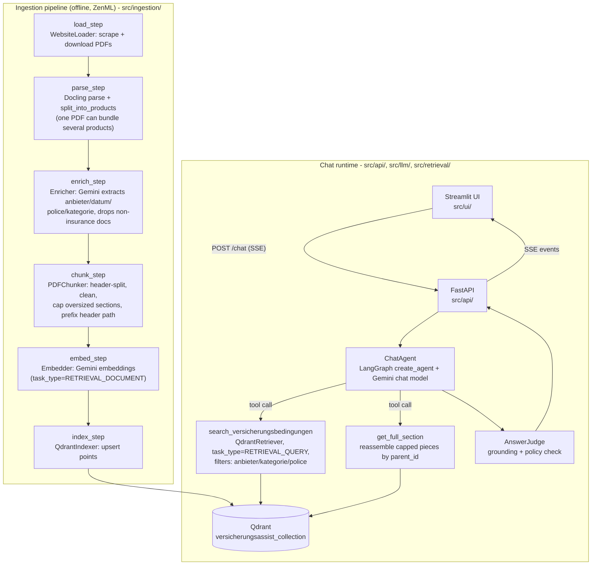

# VersicherungsAssist

A RAG chatbot that makes R+V's private-customer insurance conditions (Versicherungsbedingungen)
queryable in plain German. High priority on reliability: answers must be grounded in the
indexed documents, not invented. Inspired by the digital-twin structure from *LLM Engineer's
Handbook: Master the art of engineering large language models from concept to production*.

Unofficial demo project - not affiliated with or approved by R+V Versicherung. See the
in-app disclaimer.

**Live demo:** [https://justinwalger.de/versicherag](https://justinwalger.de/versicherag)
(password on request - see the contact in the in-app disclaimer).


## Status

Ingestion pipeline, metadata filtering, judge pass, chat UI with citations, shared-password
gate, Cloud Run deployment via Terraform, `ty`/ruff/pytest in CI, DeepEval suite (manual trigger).

### Next steps

- **Better retrieval.** Plain top-k dense search is the current baseline; the likely biggest win
  is a reranking stage (retrieve a wider candidate set, rerank down to top-k), with hybrid
  dense+sparse (BM25) search as a second option for exact-term lookups (§ references, Tarif
  codes) that embeddings alone tend to blur.
- CDC: re-run ingestion only for changed source documents, instead of a full pass.
- Run the ZenML pipeline in the cloud / trigger it automatically instead of manually.
- `verweise` follow-up: when an answer references another paragraph (e.g. "siehe § 7"), verify
  that paragraph is actually retrievable instead of citing it blind - possibly Graph RAG.
- Run the DeepEval suite automatically in CI
- More unit tests and more advanced eval cases.

## Architecture

Two halves that only share the Qdrant collection: an offline **ingestion pipeline** that turns
source PDFs into indexed, embedded chunks, and a **chat runtime** that answers questions against
that index.



### Reliability design choices

- **Grounded answers only.** The system prompt forbids the model from answering outside the
  retrieved context; `AnswerJudge` re-checks the finished answer against that same context after
  the fact and flags (but doesn't block) anything unsupported or out of policy.
- **Fixed vocabulary, not free-text extraction.** `anbieter` and `kategorie` are `Literal[...]`
  types built from `src/ingestion/models.py`'s option lists, enforced both in the Gemini
  structured-output schema and at the pydantic layer - stops the same company being extracted as
  `"RV"` in one document and `"R+V"` in another.
- **Metadata filtering.** `search_versicherungsbedingungen` takes optional `anbieter`/`kategorie`/
  `police` filters so the agent can scope a search to one product once it knows which one is
  relevant, instead of always searching the whole corpus.
- **No duplicated content for capped sections.** A section too large for one chunk is split with
  a shared `parent_id`, not by copying the full text into every piece. `get_full_section` pulls
  the siblings back together on demand via a metadata-only Qdrant query - `parent_id` is scoped by
  product (not just by source file), since one PDF can bundle several products that reuse
  identical clause numbering.
- **Password-gated API.** The Streamlit UI prompts for a shared password and forwards it on every
  request via `X-API-Password`; FastAPI checks it against `APP_PASSWORD` and rejects anything else
  with 401.

## Repository layout

```
src/
  config.py            Settings (.env-backed): Gemini keys/models, Qdrant connection, source URLs
  ingestion/
    pipeline.py         ZenML pipeline wiring the steps below together
    models.py           Pydantic models + the anbieter/kategorie option lists
    steps/              load, parse, split (product boundaries), enricher, chunk, embed, index
  retrieval/
    retriever.py        QdrantRetriever: vector search + metadata filters + parent_id reassembly
  llm/
    agent.py            ChatAgent: streams the LangGraph agent, runs the judge pass at the end
    judge.py            AnswerJudge: grounding + policy verdict
    prompts.py           System/metadata/judge prompts (German - product- and LLM-facing)
    tools/               search_versicherungsbedingungen, get_full_section
  api/                  FastAPI app, password-gated /chat SSE endpoint
  ui/                   Streamlit chat UI (prompts for the shared password)
evals/                  DeepEval suite against the live agent (real Qdrant + Gemini calls)
tests/                  Fast unit tests (mirrors src/'s package layout), no external services
notebooks/              Ad-hoc analysis (e.g. metadata_analysis.ipynb)
docker/                 Dockerfiles (used by Terraform/CI) + docker-compose.yml (currently unused
                        local-dev convenience, see "Running locally")
terraform/              Cloud Run + Artifact Registry (main.tf), one-time privileged setup
                        (bootstrap/main.tf) - see "Deployment"
.env.example            Copy to .env and fill in real values
```

## Running locally

Copy `.env.example` to `.env` and fill in `GEMINI_API_KEY`, `QDRANT_HOST`/`QDRANT_API_KEY`, and
`APP_PASSWORD` (whatever you want the UI's password prompt to require).

**Qdrant Cloud setup:** create a free-tier cluster at
[cloud.qdrant.io](https://cloud.qdrant.io) (the ~20 source PDFs here are far below what the free
tier allows) and grab its endpoint URL and an API key for `QDRANT_HOST`/`QDRANT_API_KEY` - the
project no longer runs against a local Qdrant container, so `docker/docker-compose.yml`'s
`qdrant` service is currently unused. No manual collection setup needed: `QdrantIndexer` creates
the collection (name/vector size from `Settings.qdrant_collection_name`/`qdrant_vector_size`,
3072-dim cosine to match the Gemini embedding model) automatically on first ingestion run - just
run the ingestion pipeline once before expecting the chat agent to retrieve anything.

```bash
# API
uv sync --group api
uv run fastapi dev src/api/app.py

# UI
uv sync --group ui
uv run streamlit run src/ui/app.py

# Ingestion pipeline (downloads PDFs, parses, embeds, indexes into Qdrant)
uv sync --group data
uv run python -m src.ingestion.pipeline
```

## Deployment

GCP Cloud Run, via Terraform (`terraform/`), auto-applied by `.github/workflows/deploy.yml` on
every push to `main`: builds+pushes the backend/frontend images to Artifact Registry, then
`terraform apply`s `fastapi-backend` and `streamlit-frontend` as two Cloud Run services.

One-time manual setup (not automated, and shouldn't be - see `terraform/bootstrap/main.tf`'s
comments for why the CI identity deliberately can't do this itself):

1. Create a GCS bucket for Terraform state (Terraform/GCS can't create its own backend bucket):
   `gcloud storage buckets create gs://versicherag --location=europe-west1`
2. `cd terraform/bootstrap && terraform init && terraform apply -var project_id=<gcp-project-id> \
   -var state_bucket_name=<bucket-from-step-1>` (uses local state - only ever applied manually,
   never by CI). Creates the Artifact Registry repo, the `github-actions-deployer` service
   account, and grants it `roles/storage.objectAdmin` on the state bucket (needed for the deploy
   workflow's own `terraform init`/`apply` against that bucket).
3. `terraform output -raw ci_deployer_key | base64 -d` for the service account's JSON key.
4. Set these as GitHub Actions secrets: `GCP_PROJECT_ID`, `GCP_CREDENTIALS` (the key from step 3),
   `TF_STATE_BUCKET` (the bucket from step 1), `GEMINI_API_KEY`, `QDRANT_HOST`, `QDRANT_API_KEY`,
   `APP_PASSWORD`, and (for tracing the deployed backend) `LANGSMITH_API_KEY`,
   `LANGSMITH_TRACING`, `LANGSMITH_ENDPOINT`, `LANGSMITH_PROJECT` - the latter three fall back to
   sensible defaults in `terraform/variables.tf` if left unset.

Without step 4's `TF_STATE_BUCKET` secret, `terraform init` in the deploy workflow fails
immediately (empty backend config).

## Testing

```bash
uv sync --all-groups
uv run ruff check . && uv run ruff format --check .
uv run ty check
uv run pytest tests/                 # fast unit tests, no external services

# Live eval suite - hits the real agent (Qdrant + Gemini), costs real API calls.
# Not run on every commit; trigger manually via the "DeepEval Suite (manual)" GitHub
# Actions workflow, or locally:
uv run pytest evals/test_agent.py -v
uv run pytest evals/test_agent.py -m tool_call   # just one category
```

## Wichtige Dokumente

Privatkunden-Dokumente von https://www.ruv.de/service/weitere-services/versicherungsbedingungen#privatkunden (36 Einträge, 20 eindeutige PDFs — dieselbe Datei wird teils in mehreren Kategorien gelistet).

| Doc ID | Category | Product | PDF Link |
|---|---|---|---|
| D01 | Altersvorsorge & Lebensversicherung | Bedingungsheft der R+V Lebensversicherung AG | https://www.ruv.de/dam/jcr:038d2022-558e-46d7-b161-e37647ff9a2d/PLG0426.pdf |
| D02 | Altersvorsorge & Lebensversicherung | R+V Lebensversicherung AG Niederlassung Luxemburg | https://www.ruv.de/dam/jcr:3c83cc53-f7a0-4e80-8ec4-2f3f8e5a40fc/bedinungsheft-ruv-lebensversicherung-niederlassung-luxemburg.pdf |
| D03 | Altersvorsorge & Lebensversicherung | Hinweis zum außergerichtlichen Streitbeilegungsverfahren | https://www.ruv.de/dam/jcr:8f25cbab-bcc7-4ff4-ab73-2d80ab705dc3/Hinweis-zum-au%C3%9Fergerichtlichen-Streitbeiligungsverfahren-RVL.pdf |
| D01 | Berufsunfähigkeitsversicherung | Bedingungsheft der R+V Lebensversicherung AG | https://www.ruv.de/dam/jcr:038d2022-558e-46d7-b161-e37647ff9a2d/PLG0426.pdf |
| D02 | Berufsunfähigkeitsversicherung | Bedingungsheft der R+V Luxembourg Lebensversicherung S.A. | https://www.ruv.de/dam/jcr:3c83cc53-f7a0-4e80-8ec4-2f3f8e5a40fc/bedinungsheft-ruv-lebensversicherung-niederlassung-luxemburg.pdf |
| D04 | Haus + Wohnen | R+V-MietkautionsBürgschaft Versicherungsbedingungen | https://www.ruv.de/dam/jcr:47a9ec12-7b45-4630-901c-d4a6e361ef97/mietkautionsbuergschaft-bedingungen.pdf |
| D05 | Haus + Wohnen | R+V-Privatkunden Verbraucherinformation | https://www.ruv.de/dam/jcr:41df7b64-f3f4-48be-9230-0a74d7760284/ruv-kpr-privatkunden-privatpolice-verbraucherinfo.pdf |
| D06 | Haus + Wohnen | R+V-Privatkunden PrivatPolice Comfort Verbraucherinformation | https://www.ruv.de/dam/jcr:536cbb74-a0e6-47d3-be55-f2d2860f5030/ruv-kpp-privatkunden-privatpolice-comfort-verbraucherinfo.pdf |
| D07 | Haus + Wohnen | R+V-GeräteSchutz Allgemeine Bedingungen | https://www.ruv.de/dam/jcr:39eec8f2-3568-4374-9dde-87edb956fc4d/Allgemeine%20Bedingungen%20R+V-Ger%C3%A4teSchutz.pdf |
| D08 | Haus + Wohnen | Informationen zum Darlehensvertrag | https://www.ruv.de/dam/jcr:a1e69927-3527-4ed5-8223-6ebe712d11d5/informationen-zum-darlehensvertrag.pdf |
| D09 | Haus + Wohnen | Informationen zum Prolongationsangebot | https://www.ruv.de/dam/jcr:8cb02e39-1ef6-4a44-8c4e-7b02de852006/informationen-zum-prolongationsangebot.pdf |
| D10 | Kfz-Versicherung | Kfz-Versicherung Verbraucherinformation für Pkw | https://www.ruv.de/dam/jcr:697df30d-36c9-478f-a8a0-f1783b7843e1/Verbraucherinformation_RVA_Pkw_01.07.2026.pdf |
| D11 | Kfz-Versicherung | Kfz-Versicherung Verbraucherinformation für Fahrzeuge, die keine Pkw sind | https://www.ruv.de/dam/jcr:f353bb0b-7a8f-423e-8520-78e051971d79/Verbraucherinformation_RVA_Nicht-Pkw_01.07.2026.pdf |
| D12 | Kfz-Versicherung | Allgemeine Bedingungen für die Kfz-Versicherung mit Versicherungskennzeichen (AMB) | https://www.ruv.de/dam/jcr:149bf1c9-4a74-45d3-845b-0f0f2fc554a8/ruv-kkm-moped-verbraucherinfo.pdf |
| D13 | Krankenversicherung | Bedingungsheft der R+V Krankenversicherung AG | https://www.ruv.de/dam/jcr:266e323c-c558-4fa0-a67f-820016db0dd9/pkx0726.PDF |
| D05 | Rechtsschutz-, Haftpflicht- und Hausratversicherung | R+V-Privatkunden Rechtsschutz Verbraucherinformation | https://www.ruv.de/dam/jcr:41df7b64-f3f4-48be-9230-0a74d7760284/ruv-kpr-privatkunden-privatpolice-verbraucherinfo.pdf |
| D14 | Rechtsschutz-, Haftpflicht- und Hausratversicherung | R+V-Privatkunden HausratPolice Verbraucherinformation | https://www.ruv.de/dam/jcr:5bd1b54a-9b52-461f-b836-3bb598ddc3d0/KHR0123.PDF |
| D05 | Rechtsschutz-, Haftpflicht- und Hausratversicherung | Privathaftpflicht classic (S) | https://www.ruv.de/dam/jcr:41df7b64-f3f4-48be-9230-0a74d7760284/ruv-kpr-privatkunden-privatpolice-verbraucherinfo.pdf |
| D06 | Rechtsschutz-, Haftpflicht- und Hausratversicherung | Privathaftpflicht comfort (M) | https://www.ruv.de/dam/jcr:536cbb74-a0e6-47d3-be55-f2d2860f5030/ruv-kpp-privatkunden-privatpolice-comfort-verbraucherinfo.pdf |
| D15 | Rechtsschutz-, Haftpflicht- und Hausratversicherung | Privathaftpflicht premium (L) | https://www.ruv.de/dam/jcr:454128d9-56f7-424c-a705-81bbdf4d8f31/privatkunden-verbraucherinformation-hausrat-haftpflicht-premium.pdf |
| D05 | Rechtsschutz-, Haftpflicht- und Hausratversicherung | Hausratversicherung classic (S) | https://www.ruv.de/dam/jcr:41df7b64-f3f4-48be-9230-0a74d7760284/ruv-kpr-privatkunden-privatpolice-verbraucherinfo.pdf |
| D06 | Rechtsschutz-, Haftpflicht- und Hausratversicherung | Hausratversicherung comfort (M) | https://www.ruv.de/dam/jcr:536cbb74-a0e6-47d3-be55-f2d2860f5030/ruv-kpp-privatkunden-privatpolice-comfort-verbraucherinfo.pdf |
| D15 | Rechtsschutz-, Haftpflicht- und Hausratversicherung | Hausratversicherung premium (L) | https://www.ruv.de/dam/jcr:454128d9-56f7-424c-a705-81bbdf4d8f31/privatkunden-verbraucherinformation-hausrat-haftpflicht-premium.pdf |
| D16 | Tierversicherung | Tierlebenversicherung für Pferde | https://www.ruv.de/dam/jcr:c565a8f7-e260-4455-a33b-65e92d63c154/avb_tlp.PDF |
| D17 | Tierversicherung | Operationskostenversicherung für Pferde | https://www.ruv.de/dam/jcr:99b0715a-b65a-40de-be08-d970a9659f5e/OPK_Pferd_AVB.pdf |
| D18 | Tierversicherung | Operationskostenversicherung für Hunde | https://www.ruv.de/dam/jcr:b8a71fdc-2ee5-4c21-bd54-7f56ff63579a/opk-hund-avb-erweitert.pdf |
| D05 | Tierversicherung | Tierhalterhaftpflicht classic für Pferde | https://www.ruv.de/dam/jcr:41df7b64-f3f4-48be-9230-0a74d7760284/ruv-kpr-privatkunden-privatpolice-verbraucherinfo.pdf |
| D05 | Tierversicherung | Tierhalterhaftpflicht classic für Hunde | https://www.ruv.de/dam/jcr:41df7b64-f3f4-48be-9230-0a74d7760284/ruv-kpr-privatkunden-privatpolice-verbraucherinfo.pdf |
| D06 | Tierversicherung | Tierhalterhaftpflicht comfort für Pferde | https://www.ruv.de/dam/jcr:536cbb74-a0e6-47d3-be55-f2d2860f5030/ruv-kpp-privatkunden-privatpolice-comfort-verbraucherinfo.pdf |
| D06 | Tierversicherung | Tierhalterhaftpflicht comfort für Hunde | https://www.ruv.de/dam/jcr:536cbb74-a0e6-47d3-be55-f2d2860f5030/ruv-kpp-privatkunden-privatpolice-comfort-verbraucherinfo.pdf |
| D15 | Tierversicherung | Tierhalterhaftpflicht premium für Pferde | https://www.ruv.de/dam/jcr:454128d9-56f7-424c-a705-81bbdf4d8f31/privatkunden-verbraucherinformation-hausrat-haftpflicht-premium.pdf |
| D15 | Tierversicherung | Tierhalterhaftpflicht premium für Hunde | https://www.ruv.de/dam/jcr:454128d9-56f7-424c-a705-81bbdf4d8f31/privatkunden-verbraucherinformation-hausrat-haftpflicht-premium.pdf |
| D19 | Unfallversicherung | R+V-Unfallversicherung Verbraucherinfo & Bedingungen | https://www.ruv.de/dam/jcr:14f4d452-1ae5-455d-8692-2adbf8f8429b/PUR0122.PDF |
| D20 | Unfallversicherung | R+V-Unfallversicherung mit Beitragsrückgewähr | https://www.ruv.de/dam/jcr:28f8bae4-36c3-4d94-95f2-4ba5eef3c1cc/kapital-unfallversicherung-avb-0122.pdf |
| D05 | Versicherungspaket für den Alltag | R+V-Privatkunden Verbraucherinformation | https://www.ruv.de/dam/jcr:41df7b64-f3f4-48be-9230-0a74d7760284/ruv-kpr-privatkunden-privatpolice-verbraucherinfo.pdf |
| D06 | Versicherungspaket für den Alltag | R+V-Privatkunden PrivatPolice Comfort Verbraucherinformation | https://www.ruv.de/dam/jcr:536cbb74-a0e6-47d3-be55-f2d2860f5030/ruv-kpp-privatkunden-privatpolice-comfort-verbraucherinfo.pdf |
